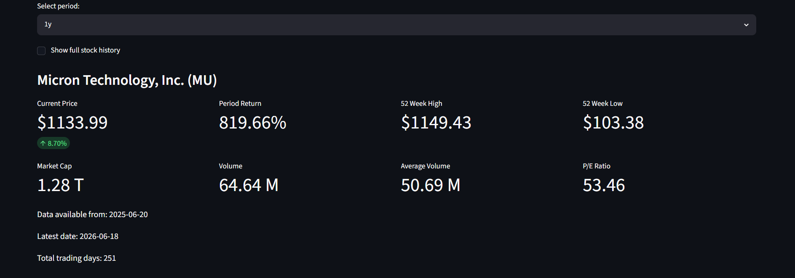
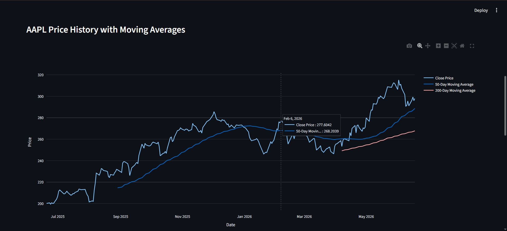
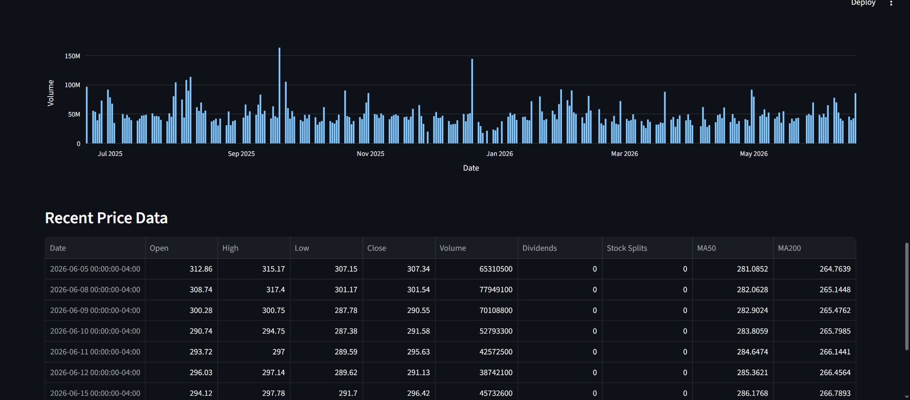
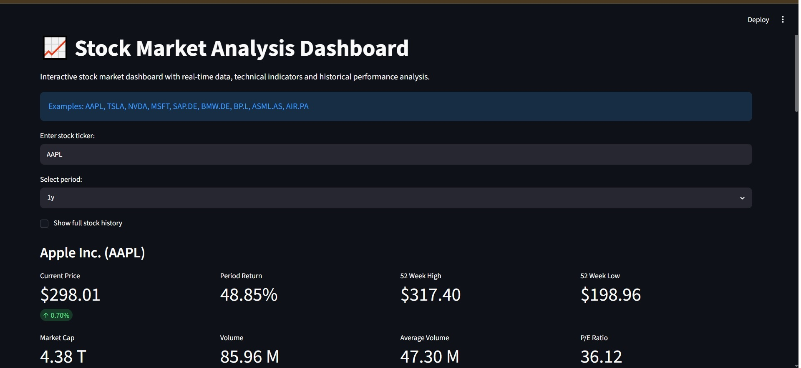
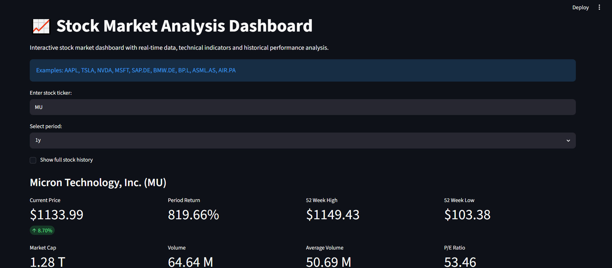
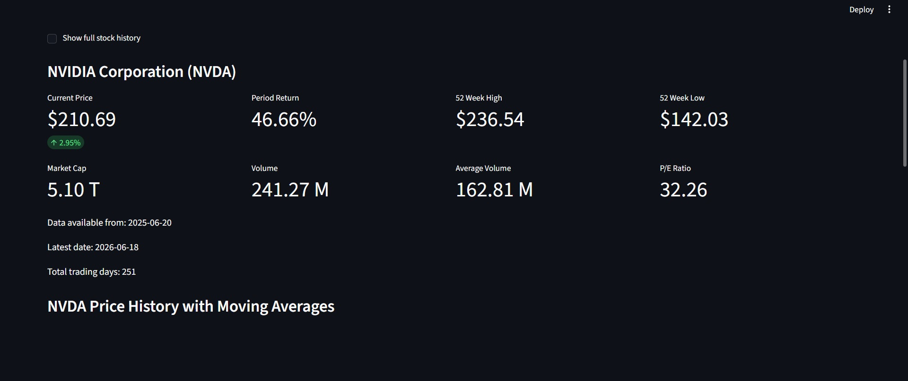

# 📈 AI Stock Market Assistant

AI-powered stock market analysis dashboard built with Python, Streamlit, Yahoo Finance, and Plotly.

## 🚀 Features

- Real-time stock market data
- Global stock ticker support
- Interactive price history charts
- 50-Day Moving Average
- 200-Day Moving Average
- Full historical data option
- Key company metrics
- Dark dashboard interface

---

## 🛠 Technologies Used

- Python
- Streamlit
- Yahoo Finance (yfinance)
- Pandas
- Plotly

---

## 📦 Installation

Clone the repository:

```bash
git clone https://github.com/cosminchirita/ai-stock-market-assistant.git
cd ai-stock-market-assistant
```

Install dependencies:

```bash
pip install -r requirements.txt
```

Run the application:

```bash
streamlit run app.py
```

---

## 📊 Dashboard Screenshots

### Dashboard Overview



---

### Price History & Technical Analysis



---

### Company Statistics



---

### Apple Example



---

### Microsoft Example



---

### NVIDIA Example



---

## 🔮 Planned Improvements

- RSI Indicator
- MACD Indicator
- Buy / Hold / Sell Signal
- Risk Score
- Volatility Score
- Portfolio Tracker
- AI-generated stock analysis
- Financial news sentiment analysis
- Multi-source market data integration

---

## 👨‍💻 Author

**Cosmin-Gabriel Chiriță**

GitHub:
https://github.com/cosminchirita

LinkedIn:
https://www.linkedin.com/in/cosmin-gabriel-chiri%C8%9B%C4%83-1aa680256/

---

## 📄 License

MIT License